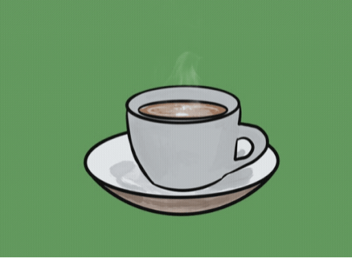

# Coffee Delivery

Esse projeto é um desafio realizado na trilha de ReactJS do Ignite, um programa de especialização da [Rocketseat](https://github.com/rocketseat-education). O objeto foi desenvolver uma aplicação para um delivery de cafés fictício, colocando em prática diversos conceitos e ferramentas do ReactJS, tais como useReducer, useEffect, imutabilidade, formulários controlled e uncontrolled, estados, Context API, LocalStorage, componentização, roteamento, e muito mais.

Ao longo do desenvolvimento desse projeto pude evoluir e aprender novas coisas, principalmente relacionadas ao TypeScript. Além disso, pude praticar o uso do hook useReducer, que facilitou o reaproveitamento de funções, e também me desafiei a implementar validações no formulário com React Hook Form e Zod, totalmente integrados ao TypeScript. Ainda, é válido destacar o uso do Styled Components que tornou o processo de estilização mais simples e prático.

#### 📌 Links
- 🎨 [Figma](https://www.figma.com/file/SDz4UyezNl7lkFu5blK3m3/Coffee-Delivery-(Copy)?node-id=0%3A1)
- 👀 [Visualize o projeto](https://luismda.github.io/coffee-delivery/)

#### ☕ Funcionalidades
- Listar os cafés disponíveis
- Adicionar uma quantidade específica de itens no carrinho
- Aumentar ou diminuir a quantidade de itens no carrinho
- Preencher no formulário o endereço de entrega e forma de pagamento
- Exibir o total de itens no carrinho no Header
- Exibir o valor total da compra no carrinho

#### 🛠 Tecnologias utilizadas
- TypeScript
- ReactJS
- Styled Components
- React Router DOM
- React Hook Form
- Zod
- Immer
- ESLint
- Vite

##

**#NeverStopLearning 🚀**
