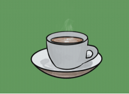

# Coffee Delivery

This project is a chalange developed in React.js trail of Ignite, a specialization program of [**Rocketseat**](https://github.com/rocketseat-education). The objective was to develop a fictitious application for the delivery of coffees, putting into practice various concepts and tools of React.js as `useReducer`, `useEffect`, immutability, controlled and uncontrolled form, states, Context API, LocalStorage, componentization, routing and a let more.

During the development this project I could evolve and learn new things, mostly related to TypeScript. Also, I could pratice the use of `useReducer` hook, which facilitated the reuse of functions, and too I challenged myself to implement form validations with React Hook Form and Zod, fully integrated into the TypeScript. Also, the use of Styled Components made the styling process simpler and easier.

#### 📌 Links
- 🎨 [Figma](https://www.figma.com/file/SDz4UyezNl7lkFu5blK3m3/Coffee-Delivery-(Copy)?node-id=0%3A1)
- 👀 [Test the application](https://luismda.github.io/coffee-delivery/)

#### ☕ Functionalities
- List available coffes
- Add a specific quantity of itens in cart
- Increase or decrease the quantity of itens in cart
- Fill in form the address delivery and payment method
- Show total of itens in cart of Header
- Calculate the total value of purchase in cart

#### 🛠 Tools
- TypeScript
- ReactJS
- Styled Components
- React Router DOM
- React Hook Form
- Zod
- Immer
- ESLint
- Vite

##

**#NeverStopLearning 🚀**
